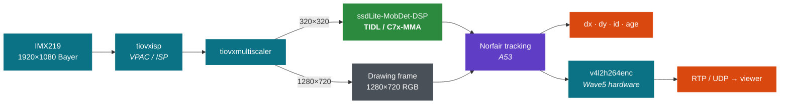
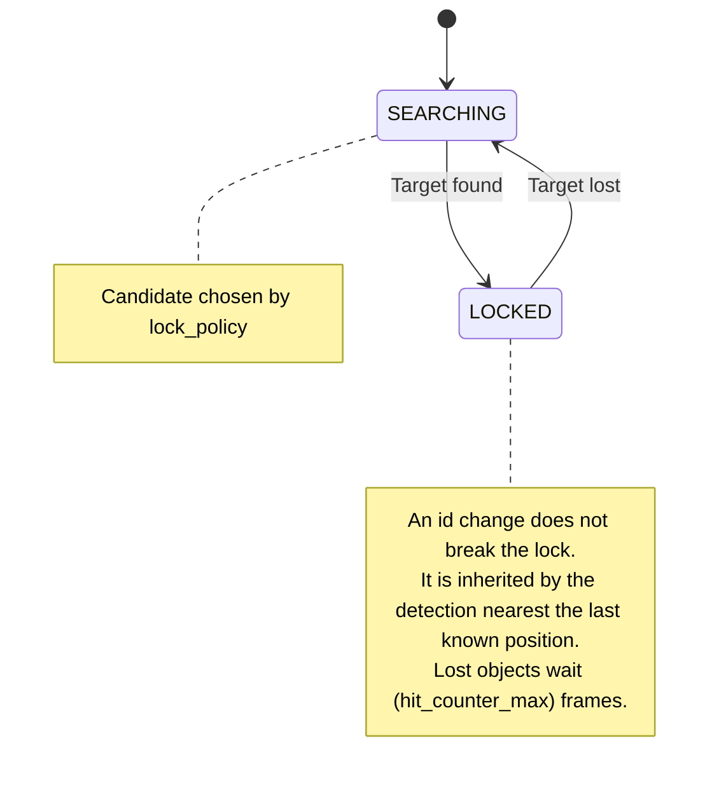
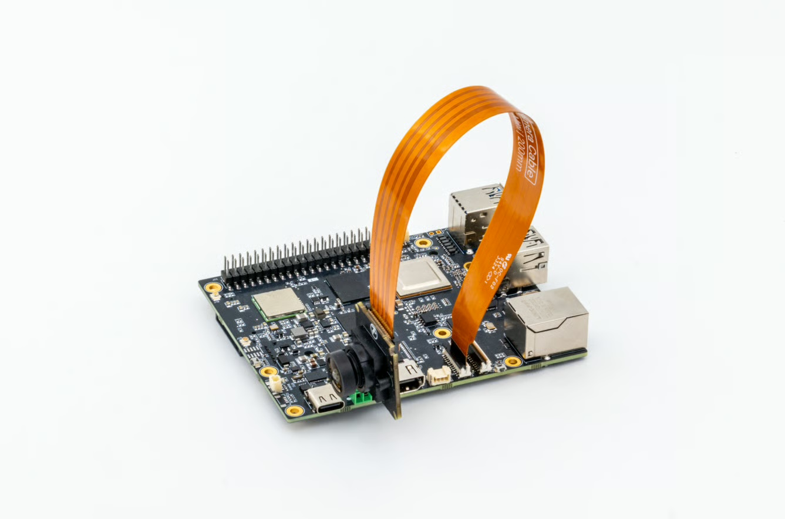
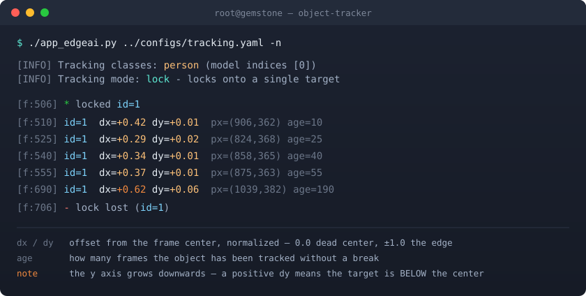
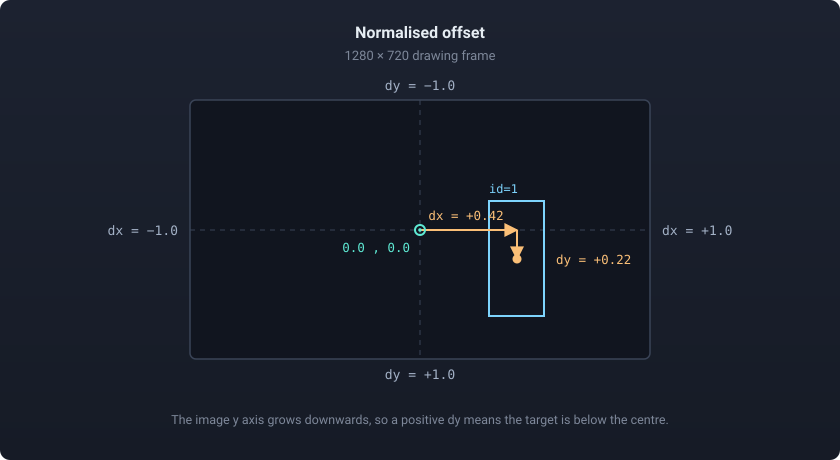

<p align="center">
    <picture>
        <source media="(prefers-color-scheme: dark)" srcset="docs/logo-dark.png" width="40%" />
        <source media="(prefers-color-scheme: light)" srcset="docs/logo-light.png" width="40%" />
        
    </picture>
</p>

# T3 Gemstone O1 Object Tracker

Hardware accelerated object detection, persistent-identity tracking and position
output on the T3 Gemstone O1.

 [](https://www.t3vakfi.org/en) [](https://docs.t3gemstone.org/en/introduction) [](https://docs.t3gemstone.org/en/boards/o1) [](https://www.ti.com/product/AM67A) [](https://www.ti.com/tool/PROCESSOR-SDK-AM67A) [](https://www.python.org/) [](https://software-dl.ti.com/jacinto7/esd/processor-sdk-linux-edgeai/) [](#performance) [](https://github.com/tryolabs/norfair) [](NOTICE)

[Türkçe](README_tr.md) · **English**

<p align="center">
    
</p>

<p align="center"><sub>Demo video in <code>lock</code> mode.</sub></p>

---

## Contents

| Section | What it covers |
|---|---|
| [How It Works](#how-it-works) | Flow, hardware split and the output produced |
| [Highlights](#highlights) | Capability summary |
| [Tracking Algorithm](#tracking-algorithm) | Behaviour of `lock` and `multi` |
| [Quick Start](#quick-start) | Install, run and view |
| [Configuration](#configuration) | Settings in `configs/tracking.yaml` |
| [Coordinate Output](#coordinate-output) | How `dx` and `dy` are computed and read |
| [Status Badge](#status-badge) | The status indicator drawn on the frame |
| [Performance](#performance) | Measurements |
| [Troubleshooting](#troubleshooting) | Common failures |
| [Repository Layout](#repository-layout) | File structure |
| [Licence](#licence) | Use and redistribution terms |

---

## How It Works



Every frame goes through object detection on the C7x accelerator. The resulting
boxes are matched across frames so each object keeps a **persistent identity**,
and each object's **normalised offset from the frame centre** (`dx`, `dy`) is
drawn on screen, printed to the terminal, and exposed to code.

That coordinate output *is* the error signal of a pan/tilt servo loop: `0.0`
when the target is centred, `+1.0` at the right edge, `-1.0` at the left.

> Derived from Texas Instruments'
> [`edgeai-gst-apps`](https://github.com/TexasInstruments/edgeai-gst-apps).
> The tracking logic is adapted from the
> [`edgeai-gst-apps-people-tracking`](https://github.com/TexasInstruments-Sandbox/edgeai-gst-apps-people-tracking)
> fork. Read [NOTICE](NOTICE) for the licence situation.

---

## Highlights

| Capability | Description |
|---|---|
| **Persistent identities** | Norfair matches boxes with IoU and a Kalman filter. An object keeps its id for as long as it stays in frame. |
| **Target lock** | The app locks onto one target. The lock survives an id change, so a controller never loses its target. |
| **Tracked object selection** | Any of the 80 COCO classes can be chosen: `person`, `car`, `dog`, `bottle`. Selection is by name, not by a fixed index. |
| **Position output** | Resolution independent `dx` and `dy`, plus the `bbox`, `cx`, `cy` and `age` fields |
| **Hardware accelerated** | Detection runs on the C7x, image processing and scaling on the VPAC, H.264 encoding on the Wave5. The A53 core only does bookkeeping. |
| **Low latency streaming** | Raw RTP with no jitter buffer; no MPEG-TS container, no player buffer |
| **On-screen status badge** | Searching or locked, and onto which id — at a glance |

---

## Tracking Algorithm

Selected by one line in `configs/tracking.yaml`: `track_mode: lock`



| Mode | Behaviour |
|---|---|
| **`lock`** | Locks onto one target and reports only that one. If its id dies, the lock is inherited by the detection nearest the last known position. |
| **`multi`** | No lock; every object gets its own id and every coordinate is printed. |

---

## Quick Start

### Prerequisites

<div align="center">
  
  <br>
  <sub>Camera module attached to the T3 Gemstone O1</sub>
</div>

| Requirement | Note |
|---|---|
| T3 Gemstone O1 | May work on other TI boards, only verified on this one. |
| Camera | Must be reachable by the board. |
| `t3-gem-o1-edgeai` package | Installed separately, not part of the board image |
| Norfair library | The only extra dependency: `pip3 install norfair` |

### 1. Install the Edge AI Package

The board image does not include it. This package provides the TIDL runtime,
the model zoo and the TIOVX GStreamer plugins.

```bash
sudo apt update
sudo apt install t3-gem-o1-edgeai
```

### 2. Enable the C7x Overlay

The accelerators are brought up by a device tree overlay. Append
`k3-am67a-t3-gem-o1-edgeai-apps.dtbo` to the **end** of the `overlays=` line in
`/boot/uEnv.txt`, separated by a space:

```bash
sudo nano /boot/uEnv.txt
```

```text
overlays=<other overlays...> k3-am67a-t3-gem-o1-edgeai-apps.dtbo
```

```bash
sudo reboot
```

> [!NOTE]
> Without this overlay the C7x cores never come up and TIDL fails with
> `bad phdr`. Full instructions:
> [T3 Gemstone Edge AI documentation](https://docs.t3gemstone.org/en/boards/o1/ai/installation).

### 3. Prepare the Camera

Camera nodes are renumbered on every boot, so `setup_cameras.sh` must be run
**once after each reboot**. It configures the CSI receiver and binds the IMX219
sensor to the right format. Skip it and the app fails with
`Could not get allowed GstCaps of device`.

```bash
sudo su
source /opt/t3-edgeai-env
bash /opt/edgeai-gst-apps/scripts/setup_cameras.sh
```

The script prints the camera it found and the node it assigned. If the IMX219
does not appear, check the ribbon cable before starting the app.

### 4. Run the App

```bash
cd /home/gemstone/t3-gemstone-o1-object-tracker/apps_python
./app_edgeai.py ../configs/tracking.yaml -n
```

The `-n` flag is **required** to see coordinates: by default the app gives the
terminal to an ncurses performance table and suppresses plain output. Run
**without** `-n` to measure FPS.

No camera at hand? `tracking-video.yaml` runs the same tracker over a video file
and writes an annotated copy instead of streaming. Point its `source` at your own
clip and keep the input at 1920×1080.

```bash
./app_edgeai.py ../configs/tracking-video.yaml
```

> [!IMPORTANT]
> **Become root, do not run under `sudo`.** `sudo` strips `PYTHONPATH` and
> `LD_LIBRARY_PATH` even with `-E`, and those are exactly what
> `/opt/t3-edgeai-env` sets. `sudo -E ./app_edgeai.py` gives you
> `ModuleNotFoundError: No module named 'edgeai_dl_inferer'` — not because the
> module is missing, but because its path is gone.

> [!WARNING]
> **Stop with `Ctrl+C`** and wait for `APP: Deinit ... Done !!!`. Killing the
> process with `kill -9` leaves TIOVX resources held; the next start hangs at
> `MEM: Init` and only a reboot clears it.

### 5. View the Stream

```bash
gst-launch-1.0 udpsrc port=5000 \
  caps="application/x-rtp,media=video,encoding-name=H264,payload=96,clock-rate=90000" \
  ! rtpjitterbuffer latency=0 ! rtph264depay ! avdec_h264 \
  ! autovideosink sync=false
```

---

## Configuration

One file: **`configs/tracking.yaml`**. Two lines to choose before you start.

```yaml
models:
    model0:
        track_mode: lock        # Lock onto one target, or track many
        track_classes: [person] # Object to track
        enable_tracking: True
```

<details>
<summary><b>Trackable classes</b> (COCO-80)</summary>

```
PEOPLE/ANIMALS  person, cat, dog, horse, sheep, cow, elephant, bear, zebra,
                giraffe, bird
VEHICLES        car, truck, bus, motorcycle, bicycle, train, airplane, boat
OBJECTS         backpack, umbrella, handbag, tie, suitcase, bottle, cup, fork,
                knife, spoon, bowl, chair, couch, bed, dining table, toilet, tv,
                laptop, mouse, remote, keyboard, cell phone, microwave, oven,
                sink, refrigerator, book, clock, vase, scissors, teddy bear,
                potted plant
SPORTS          sports ball, frisbee, skis, snowboard, kite, baseball bat,
                skateboard, surfboard, tennis racket
FOOD            banana, apple, sandwich, orange, broccoli, carrot, hot dog,
                pizza, donut, cake
TRAFFIC         traffic light, fire hydrant, stop sign, parking meter, bench
```

Multiple names are allowed (`[person, dog]`); an empty list (`[]`) tracks every
class. Names are resolved through `dataset_info` rather than a hardcoded index,
so the filter stays correct if the model changes. A misspelt name produces a
startup warning listing available names instead of silently tracking nothing.

</details>

<details>
<summary><b>Fine tuning</b></summary>

| Key | Default | What it does |
|---|---|---|
| `viz_threshold` | `0.6` | Detection confidence threshold. Lowering it catches more, and produces more false positives |
| `hit_counter_max` | `30` | How many frames an id survives without a matching detection (30 at 30 FPS = 1 second) |
| `initialization_delay` | `4` | Frames before an object counts as real — the false positive filter |
| `lock_policy` | `closest_to_center` | Which candidate to lock onto: `closest_to_center`, `largest`, `first` |

`hit_counter_max` was originally `5` (~0.17 s), short enough that a stationary
person changed identity several times a minute. Every rename breaks anything
downstream that locked onto an id; one second of grace removed the churn.

</details>

---

## Coordinate Output

<div align="center">
  
</div>

### How It Is Computed

The centre of the box comes from its corners:

$$
c_x = \frac{x_1 + x_2}{2}
\qquad\qquad
c_y = \frac{y_1 + y_2}{2}
$$

The normalised offset is that centre's distance from the frame centre, divided
by half the frame:

$$
d_x = \frac{c_x - \tfrac{W}{2}}{\tfrac{W}{2}}
\qquad\qquad
d_y = \frac{c_y - \tfrac{H}{2}}{\tfrac{H}{2}}
$$

Here $W \times H$ is the drawing frame, 1280 × 720. The model input size does not
enter this calculation.

<div align="center">
  
</div>

> [!CAUTION]
> **The sign of `dy` matters.** The image y axis grows **downwards**, so a
> **positive `dy` means the target is BELOW the centre.** If your tilt servo
> treats "up" as positive, negate `dy` before feeding it; the wrong sign makes
> the loop run away from the target instead of towards it.

`dx` and `dy` are deliberately **not clamped** to `[-1, 1]`: while an object is
briefly occluded the predicted box can drift past the frame edge, and a consumer
is better off seeing that than a value pinned at the border. Drawing is clamped
separately.

### Reading It From Code

```python
# apps_python/post_process.py -> PostProcessTracking
self.tracked_positions = [
    {"id": 3, "dx": -0.42, "dy": 0.11,
     "bbox": [310, 250, 432, 548], "cx": 371, "cy": 399, "age": 47},
]
```

The list is rebuilt every frame rather than mutated in place, so reading it from
another thread is safe.

---

## Status Badge

Top left corner, what the flow is doing right now:

| Badge | Meaning | Colour |
|---|---|---|
| `SEARCHING` | No target, searching | 🔵 |
| `LOCKED id=3` | `lock` mode, locked onto one target | 🟢 |
| `TRACKING: 4 objects` | `multi` mode, 4 objects tracked | 🟢 |

Which mode is configured is printed once at startup, not repeated in the badge.

---

## Performance

1920×1080 input, 1280×720 output, hardware H.264 encoding, `track_mode: lock`:

| Input | dl-inference | Total | FPS |
|---|---|---|---|
| Live IMX219 camera | 19.86 ms | 34.33 ms | **29.13** |
| Video file | 19.09 ms | 45.07 ms | 22.19 |

Inference costs the same either way, to within noise. The whole 11 ms gap sits in
the rest of the pipeline: on file input the Wave5 block decodes and encodes at the
same time, while on the camera path the decoder is idle and raw Bayer frames go
straight to the ISP.

Detection dominates the frame budget. The tracking layer itself is almost free:
it runs on the A53 but only does IoU and Kalman arithmetic on a handful of boxes,
never touching pixels. Detection runs on the C7x and does not occupy the A53 at
all.

<details>
<summary><b>Why visual tracking (CSRT/KCF) is not used</b></summary>

"Detect once, then hand off to a visual tracker" is **slower** on this hardware,
because it moves the work off the accelerator and onto a general purpose CPU.
Measured on this board (720p frame, 160×320 box, ms per frame):

| | Full res | 640×360 | 320×180 |
|---|---|---|---|
| CSRT | 375 | 188 | 166 |
| KCF | 217 | 50 | 49 |
| MOSSE | 29 | 7.3 | 1.9 |

The pipeline has ~34 ms per frame in total; CSRT and KCF blow that budget on
their own. Note CSRT barely gets cheaper when the frame shrinks — its cost is
the filter it learns, not the area it scans.

MOSSE with periodic re-detection was built and measured end to end at
**12.59 FPS**. The code remains in `post_process.py` as `track_mode: hybrid` but
is not offered in the config: it only makes sense if you need to track something
the model cannot name.

</details>

---

## Troubleshooting

| Symptom | Cause | Fix |
|---|---|---|
| `ModuleNotFoundError: edgeai_dl_inferer` | Environment not loaded, or run under `sudo` | `sudo su` → `source /opt/t3-edgeai-env`, do not use `sudo` |
| `Could not get allowed GstCaps of device` | `setup_cameras.sh` not run after a reboot | Run the script again |
| Init looks clean, then a silent `APP: Deinit` | Another process is holding the camera | `pgrep -a -f app_edgeai.py` |
| Hangs at `MEM: Init` / `IPC: Init` | A previous process was `kill -9`ed, TIOVX is wedged | Reboot |
| No coordinate lines printed | The ncurses performance table owns the terminal | Run with `-n` |
| It says `Model Type: detection` — is tracking running? | `task_type` describes what the **model** does; tracking is a post-processing layer | Expected |
| Picture smears into blocks | Player buffer too small, frames being dropped | Do not set the receiver buffer to zero |

---

## Repository Layout

```
apps_python/
    app_edgeai.py       entry point
    config_parser.py    YAML config → flow/subflow objects
    gst_wrapper.py      GStreamer pipeline construction
    infer_pipe.py       inference thread: capture → inference → post-processing
    post_process.py     all post-processing classes, including PostProcessTracking
    path_draw.py        motion trail drawing
configs/
    tracking.yaml          live camera in, RTP stream out
    tracking-video.yaml    video file in, video file out
    gst_plugins_map.yaml   per-SoC GStreamer element map (read by the code)
docs/
    demo.gif               live tracking demo
    hardware.jpg           board and camera photo
    logo-dark.png          project logo, dark theme
    logo-light.png         project logo, light theme
    t3-foundation.svg      T3 Foundation badge
    terminal.svg           coordinate output illustration
    coordinates.svg        dx / dy diagram
```

Camera setup uses `/opt/edgeai-gst-apps/scripts/setup_cameras.sh`; no copy is
kept in this repository.

---

## Licence

See [LICENSE](LICENSE) and [NOTICE](NOTICE).
