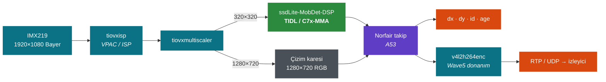
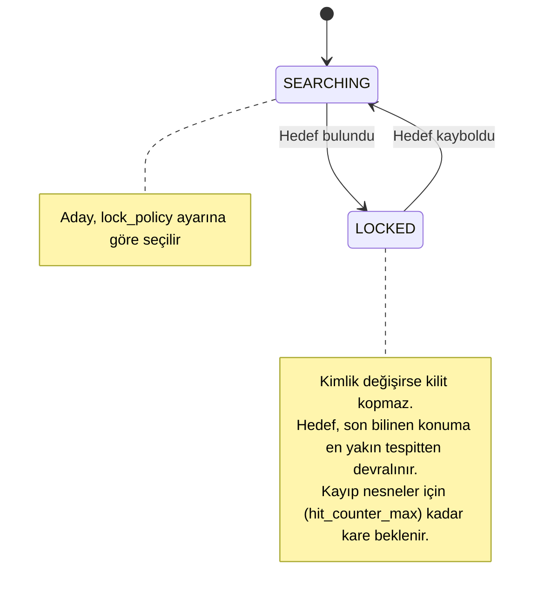
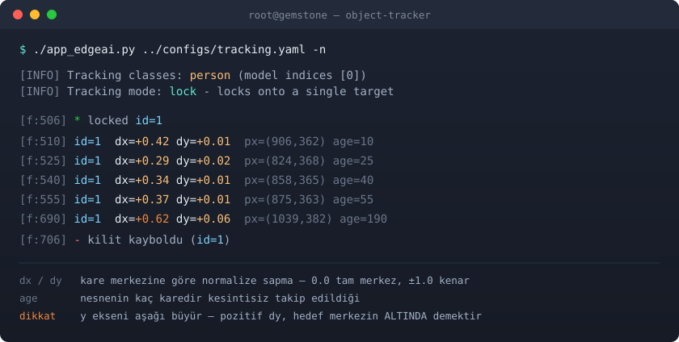
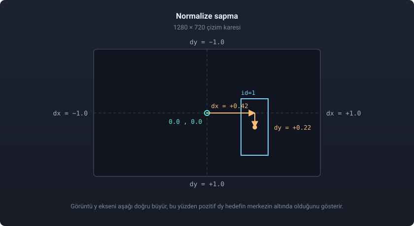

<p align="center">
    <picture>
        <source media="(prefers-color-scheme: dark)" srcset="docs/logo-dark.png" width="40%" />
        <source media="(prefers-color-scheme: light)" srcset="docs/logo-light.png" width="40%" />
        
    </picture>
</p>

# T3 Gemstone O1 Object Tracker

T3 Gemstone O1 üzerinde donanım hızlandırmalı nesne tespiti, kalıcı kimlikli
takip ve konum çıktısı.

 [](https://www.t3vakfi.org/tr) [](https://docs.t3gemstone.org/tr/introduction) [](https://docs.t3gemstone.org/tr/boards/o1) [](https://www.ti.com/product/AM67A) [](https://www.ti.com/tool/PROCESSOR-SDK-AM67A) [](https://www.python.org/) [](https://software-dl.ti.com/jacinto7/esd/processor-sdk-linux-edgeai/) [](#performans) [](https://github.com/tryolabs/norfair) [](NOTICE)

**Türkçe** · [English](README.md)

<p align="center">
    
</p>

<p align="center"><sub><code>lock</code> modunda demo videosu.</sub></p>

---

## İçindekiler

| Bölüm | İçerik |
|---|---|
| [Nasıl Çalışır?](#nasıl-çalışır) | Akış, donanım dağılımı ve üretilen çıktı |
| [Öne Çıkanlar](#öne-çıkanlar) | Yetenek özeti |
| [Takip Algoritması](#takip-algoritması) | `lock` ve `multi` modlarının davranışı |
| [Hızlı Başlangıç](#hızlı-başlangıç) | Kurulum, çalıştırma ve izleme adımları |
| [Yapılandırma](#yapılandırma) | `configs/tracking.yaml` ayarları |
| [Koordinat Çıktısı](#koordinat-çıktısı) | `dx` ve `dy` hesabı, koddan okuma |
| [Durum Rozeti](#durum-rozeti) | Ekrandaki durum göstergesi |
| [Performans](#performans) | Ölçüm sonuçları |
| [Sorun Giderme](#sorun-giderme) | Sık karşılaşılan hatalar |
| [Depo Yapısı](#depo-yapısı) | Dosya düzeni |
| [Lisans](#lisans) | Kullanım ve dağıtım koşulları |

---

## Nasıl Çalışır?



Kameradan gelen her kare C7x hızlandırıcısında nesne tespitinden geçer. Tespit
edilen kutular kareler arasında eşleştirilir ve her nesne kalıcı bir kimlik
alır. Uygulama bu nesnelerin kare merkezine göre normalize sapmasını `dx` ve
`dy` olarak hem ekrana çizer, hem terminale basar, hem de koddan okunabilir
biçimde sunar.

Bu koordinat çıktısı bir pan/tilt servo döngüsünün hata sinyalidir. Hedef
merkezdeyken değer `0.0`, sağ kenardayken `+1.0`, sol kenardayken `-1.0` olur.

> Bu depo Texas Instruments firmasının
> [`edgeai-gst-apps`](https://github.com/TexasInstruments/edgeai-gst-apps)
> uygulamasından türetilmiştir. Takip mantığı
> [`edgeai-gst-apps-people-tracking`](https://github.com/TexasInstruments-Sandbox/edgeai-gst-apps-people-tracking)
> forkundan uyarlanmıştır. Lisans durumu için [NOTICE](NOTICE) dosyasını okuyun.

---

## Öne Çıkanlar

| Yetenek | Açıklama |
|---|---|
| **Kalıcı kimlik** | Norfair kütüphanesi kutuları IoU ve Kalman süzgeciyle eşleştirir. Nesne kadrajda kaldığı sürece kimliği değişmez. |
| **Hedef kilidi** | Uygulama tek hedefe kilitlenir. Kimlik değişse bile kilit kopmaz, kontrolcü hedefini kaybetmez. |
| **Takip nesnesi seçimi** | COCO veri kümesindeki 80 sınıftan herhangi biri seçilebilir: `person`, `car`, `dog`, `bottle`. Seçim sabit indeksle değil adla yapılır. |
| **Konum çıktısı** | Çözünürlükten bağımsız `dx` ve `dy` değerleri, ayrıca `bbox`, `cx`, `cy`, `age` alanları |
| **Donanım hızlandırma** | Tespit C7x üzerinde, görüntü işleme ve ölçekleme VPAC üzerinde, H.264 kodlama Wave5 üzerinde çalışır. A53 çekirdeği yalnızca defter tutar. |
| **Düşük gecikme yayını** | Ham RTP yayını, jitter tamponu kapalı. MPEG-TS konteyneri ve oynatıcı tamponu devre dışı |
| **Ekranda durum rozeti** | Hedef aranıyor mu, kilitli mi, hangi kimliğe kilitli. Tek bakışta görülür |

---

## Takip Algoritması

Mod, `configs/tracking.yaml` dosyasındaki tek satırla seçilir: `track_mode: lock`



| Mod | Davranış |
|---|---|
| **`lock`** | Uygulama tek hedefe kilitlenir ve yalnızca onu bildirir. Kimlik ölürse hedef, son bilinen konuma en yakın tespitten devralınır. |
| **`multi`** | Kilit yoktur. Her nesneye ayrı kimlik verilir ve hepsinin koordinatı basılır. |

---

## Hızlı Başlangıç

### Önkoşullar

<div align="center">
  
  <br>
  <sub>T3 Gemstone O1 üzerine bağlı kamera modülü</sub>
</div>

| Gereksinim | Not |
|---|---|
| T3 Gemstone O1 | Başka TI kartlarında da çalışabilir, yalnızca bu kartta doğrulandı. |
| Kamera | Kart tarafından erişilebilir olmalı. |
| `t3-gem-o1-edgeai` paketi| Ayrıca kurulur, kart imajıyla gelmez |
| Norfair kütüphanesi | Tek ek bağımlılıktır: `pip3 install norfair` |

### 1. Edge AI Paketini Kurun

Kart imajı bu paketi içermez. TIDL çalışma zamanı, model deposu ve TIOVX
GStreamer eklentileri bu paketle gelir.

```bash
sudo apt update
sudo apt install t3-gem-o1-edgeai
```

### 2. C7x Overlay'ini Etkinleştirin

Hızlandırıcılar bir device tree overlay ile açılır. `/boot/uEnv.txt` dosyasındaki
`overlays=` satırının sonuna, boşluk bırakarak
`k3-am67a-t3-gem-o1-edgeai-apps.dtbo` ekleyin.

```bash
sudo nano /boot/uEnv.txt
```

```text
overlays=<diğer overlay'ler...> k3-am67a-t3-gem-o1-edgeai-apps.dtbo
```

```bash
sudo reboot
```

> [!NOTE]
> Bu overlay olmadan C7x çekirdekleri açılmaz ve TIDL `bad phdr` hatası verir.
> Ayrıntılı kurulum için
> [T3 Gemstone Edge AI dökümantasyonuna](https://docs.t3gemstone.org/tr/boards/o1/ai/installation)
> bakın.

### 3. Kamerayı Hazırlayın

Kamera düğümleri her açılışta yeniden numaralandığı için `setup_cameras.sh`
betiği **her yeniden başlatmadan sonra bir kez** çalıştırılmalıdır. Betik CSI
alıcısını yapılandırır ve IMX219 sensörünü doğru formata bağlar. Bu adım
atlanırsa uygulama `Could not get allowed GstCaps of device` hatası verir.

```bash
sudo su
source /opt/t3-edgeai-env
bash /opt/edgeai-gst-apps/scripts/setup_cameras.sh
```

Betik, bulduğu kamerayı ve atadığı düğümü ekrana yazar. Çıktıda kameranız
görünmüyorsa uygulamayı çalıştırmadan önce kablo bağlantısını kontrol edin.

### 4. Uygulamayı Çalıştırın

```bash
cd /home/gemstone/t3-gemstone-o1-object-tracker/apps_python
./app_edgeai.py ../configs/tracking.yaml -n
```

`-n` bayrağı koordinat çıktısı için zorunludur. Varsayılan durumda uygulama
terminali ncurses performans tablosuna ayırır ve düz çıktıyı bastırır. FPS
ölçmek için uygulamayı `-n` bayrağı olmadan çalıştırın.

Elinizde kamera yoksa `tracking-video.yaml` aynı takipçiyi bir video dosyası
üzerinde çalıştırır ve yayın yerine işaretlenmiş bir kopya yazar. `source`
satırını kendi klibinize çevirin, girdiyi 1920 × 1080 tutun.

```bash
./app_edgeai.py ../configs/tracking-video.yaml
```

> [!IMPORTANT]
> Uygulamayı `sudo` ile çalıştırmayın, önce root olun. `sudo` komutu `-E`
> bayrağı verilse bile `PYTHONPATH` ve `LD_LIBRARY_PATH` değişkenlerini siler.
> Bu değişkenleri ayarlayan dosya `/opt/t3-edgeai-env` dosyasıdır. Aksi halde
> `ModuleNotFoundError: No module named 'edgeai_dl_inferer'` hatası alırsınız.
> Hatanın sebebi eksik modül değil, kaybolan yoldur.

> [!WARNING]
> Uygulamayı kapatırken `Ctrl+C` kullanın ve `APP: Deinit ... Done !!!` satırını
> gördüğünüzden emin olun. Süreci `kill -9` ile öldürmek TIOVX kaynaklarını asılı
> bırakır. Sonraki açılış `MEM: Init` satırında takılır ve tek çözüm kartı
> yeniden başlatmaktır.

### 5. Yayını İzleyin

```bash
gst-launch-1.0 udpsrc port=5000 \
  caps="application/x-rtp,media=video,encoding-name=H264,payload=96,clock-rate=90000" \
  ! rtpjitterbuffer latency=0 ! rtph264depay ! avdec_h264 \
  ! autovideosink sync=false
```

---

## Yapılandırma

Tek dosya kullanılır: **`configs/tracking.yaml`**. Çalıştırmadan önce iki satır
seçersiniz.

```yaml
models:
    model0:
        track_mode: lock        # Kilitlenme ya da çoklu takip modu
        track_classes: [person] # Takip edilecek nesne
        enable_tracking: True
```

<details>
<summary><b>Takip edilebilecek sınıflar</b></summary>

COCO veri kümesindeki 80 sınıfın tamamı kullanılabilir.

```
İNSAN/HAYVAN  person, cat, dog, horse, sheep, cow, elephant, bear, zebra,
              giraffe, bird
ARAÇ          car, truck, bus, motorcycle, bicycle, train, airplane, boat
EŞYA          backpack, umbrella, handbag, tie, suitcase, bottle, cup, fork,
              knife, spoon, bowl, chair, couch, bed, dining table, toilet, tv,
              laptop, mouse, remote, keyboard, cell phone, microwave, oven,
              sink, refrigerator, book, clock, vase, scissors, teddy bear,
              potted plant
SPOR          sports ball, frisbee, skis, snowboard, kite, baseball bat,
              skateboard, surfboard, tennis racket
YİYECEK       banana, apple, sandwich, orange, broccoli, carrot, hot dog,
              pizza, donut, cake
TRAFİK        traffic light, fire hydrant, stop sign, parking meter, bench
```

Birden fazla sınıf yazılabilir. Boş liste her sınıfı takip eder.

```yaml
track_classes: [person, dog]    # yalnızca insan ve köpek
track_classes: []               # tüm sınıflar
```

Ad çözümlemesi sabit sınıf indeksiyle değil `dataset_info` üzerinden yapıldığı
için model değiştiğinde de çalışır. Yanlış ad yazarsanız açılışta uyarı basılır
ve mevcut isimlerden örnek gösterilir.

</details>

<details>
<summary><b>İnce ayarlar</b></summary>

| Anahtar | Varsayılan | Ne yapar |
|---|---|---|
| `viz_threshold` | `0.6` | Tespit güven eşiğidir. Düşürmek daha çok nesne yakalar, yanlış pozitifi arttırır |
| `hit_counter_max` | `30` | Bir kimliğin, eşleşen tespit olmadan kaç kare yaşayacağını belirler. 30 FPS hızda 30 kare bir saniyeye karşılık gelir |
| `initialization_delay` | `4` | Bir nesnenin gerçek sayılması için gereken kare sayısıdır. Yanlış pozitif filtresi olarak çalışır |
| `lock_policy` | `closest_to_center` | Kilit yokken hangi adayın seçileceğini belirler: `closest_to_center`, `largest` veya `first` |

`hit_counter_max` değeri başlangıçta `5` idi ve yaklaşık 0.17 saniyeye karşılık
geliyordu. Bu sürede sabit duran bir kişi bile dakikada birkaç kez kimlik
değiştiriyordu. Kimliğe kilitlenen her tüketici bu yeniden adlandırmalardan
etkilenir. Bir saniyelik tolerans sorunu ortadan kaldırdı.

</details>

---

## Koordinat Çıktısı

<div align="center">
  
</div>

### Hesap

Kutunun merkezi köşe noktalarından bulunur:

$$
c_x = \frac{x_1 + x_2}{2}
\qquad\qquad
c_y = \frac{y_1 + y_2}{2}
$$

Normalize sapma, bu merkezin kare merkezine olan uzaklığının kare yarısına
bölünmesiyle elde edilir:

$$
d_x = \frac{c_x - \tfrac{W}{2}}{\tfrac{W}{2}}
\qquad\qquad
d_y = \frac{c_y - \tfrac{H}{2}}{\tfrac{H}{2}}
$$

Buradaki $W \times H$ çizim karesinin boyutudur ve 1280 × 720 değerindedir.
Model giriş boyutu bu hesaba girmez.

<div align="center">
  
</div>

> [!CAUTION]
> İşaret yönü kritiktir. Görüntü y ekseni aşağı doğru büyür, dolayısıyla pozitif
> `dy` değeri hedefin merkezin altında olduğu anlamına gelir. Tilt servonuz yukarı
> yönü pozitif kabul ediyorsa `dy` değerini ters çevirerek besleyin. Yanlış işaret,
> döngünün hedefe yaklaşmak yerine hedeften kaçmasına yol açar.

`dx` ve `dy` değerleri bilinçli olarak `[-1, 1]` aralığına kırpılmaz. Bir nesne
kısa süre görüş alanından çıktığında tahmin edilen kutu kare sınırını aşabilir.
Tüketicinin bunu görmesi, sınıra sabitlenmiş bir değer görmesinden yararlıdır.
Yalnızca ekrana yapılan çizim kırpılır.

### Koddan Okuma

```python
# apps_python/post_process.py -> PostProcessTracking
self.tracked_positions = [
    {"id": 3, "dx": -0.42, "dy": 0.11,
     "bbox": [310, 250, 432, 548], "cx": 371, "cy": 399, "age": 47},
]
```

Liste her karede baştan oluşturulur, yerinde değiştirilmez. Bu nedenle başka bir
iş parçacığından okumak güvenlidir.

---

## Durum Rozeti

Karenin sol üst köşesinde uygulamanın o anda ne yaptığı gösterilir.

| Rozet | Anlamı | Renk |
|---|---|---|
| `SEARCHING` | Hedef yok | 🔵 |
| `LOCKED id=3` | `lock` modu, tek hedefe kilitli | 🟢 |
| `TRACKING: 4 objects` | `multi` modu, 4 nesne izleniyor | 🟢 |

Hangi modun yapılandırıldığı açılışta bir kez basılır, rozette tekrarlanmaz.

---

## Performans

Ölçümler 1920 × 1080 girdi, 1280 × 720 çıkış, donanım H.264 kodlama ve
`track_mode: lock` ile alınmıştır.

| Girdi | dl-inference | Toplam | FPS |
|---|---|---|---|
| Canlı IMX219 kamera | 19.86 ms | 34.33 ms | **29.13** |
| Video dosyası | 19.09 ms | 45.07 ms | 22.19 |

Tabloda dikkat çeken şey şu: çıkarım süresi iki satırda da aynı. 19.86 ile 19.09
arasındaki fark ölçüm dalgalanmasından ibaret. Demek ki iki durumu birbirinden
ayıran şey model değil.

Fark toplam sürede ortaya çıkıyor ve sebebi Wave5. Dosya okurken Wave5 aynı anda
iki iş yapmak zorunda: bir yandan gelen videoyu çözüyor, bir yandan çıkan videoyu
kodluyor. Kamerada ise çözecek bir şey yok. Ham Bayer kareler sensörden doğrudan
ISP'ye gidiyor ve Wave5 yalnızca kodlama yapıyor. Aradaki 11 milisaniye tam
olarak bu.

Kare başına harcanan sürenin büyük bölümü tespite gidiyor. Takibin kendi payı ise
ölçülemeyecek kadar küçük. Bunun sebebi işin nerede yapıldığı. Tespit C7x
hızlandırıcısında çalışıyor ve A53 çekirdeğine hiç dokunmuyor. Takip A53'te
çalışıyor ama piksellerle uğraşmıyor, yalnızca birkaç kutunun koordinatı üzerinde
IoU ve Kalman hesabı yapıyor. Yani takip eklemek kare hızını neredeyse hiç
etkilemiyor.

<details>
<summary><b>Neden görsel takip kullanılmıyor</b></summary>

Hedefi bir kez tespit edip sonrasında CSRT ya da KCF gibi bir görsel takipçiye
bırakma yaklaşımı bu donanımda daha yavaştır, çünkü işi hızlandırıcıdan alıp
genel amaçlı işlemciye taşır. Bu kartta 720p kare ve 160 × 320 kutu ile ölçülen
kare başına süreler şöyledir.

| Takipçi | Tam çözünürlük | 640×360 | 320×180 |
|---|---|---|---|
| CSRT | 375 ms | 188 ms | 166 ms |
| KCF | 217 ms | 50 ms | 49 ms |
| MOSSE | 29 ms | 7.3 ms | 1.9 ms |

Boru hattının kare başına toplam bütçesi yaklaşık 34 ms'dir. CSRT ve KCF tek
başına bu bütçeyi aşar. CSRT küçültmekle neredeyse hiç ucuzlamaz, çünkü maliyeti
taradığı alandan değil öğrendiği süzgeçten gelir.

MOSSE ve periyodik yeniden tespit birlikte denendi, uçtan uca 12.59 FPS ölçüldü.
Kod `post_process.py` içinde `track_mode: hybrid` olarak durur ancak
yapılandırmada sunulmaz. Yalnızca modelin adlandıramadığı bir nesneyi takip
etmeniz gerekirse anlamlıdır.

</details>

---

## Sorun Giderme

| Belirti | Sebep | Çözüm |
|---|---|---|
| `ModuleNotFoundError: edgeai_dl_inferer` | Ortam yüklenmemiş ya da uygulama `sudo` ile çalıştırılmış | `sudo su` komutundan sonra `source /opt/t3-edgeai-env` çalıştırın, `sudo` kullanmayın |
| `Could not get allowed GstCaps of device` | Yeniden başlatmadan sonra `setup_cameras.sh` çalıştırılmamış | Betiği tekrar çalıştırın |
| İnit temiz geçiyor, sonra sessizce `APP: Deinit` | Kamerayı başka bir süreç tutuyor | `pgrep -a -f app_edgeai.py` ile süreci bulun |
| `MEM: Init` ya da `IPC: Init` satırında takılıyor | Önceki süreç `kill -9` ile öldürülmüş, TIOVX kilitli | Kartı yeniden başlatın |
| Koordinat satırları basılmıyor | ncurses performans tablosu açık | Uygulamayı `-n` bayrağıyla çalıştırın |
| `Model Type: detection` yazıyor | `task_type` alanı modelin ne yaptığını söyler, takip bir son işleme katmanıdır | Normal davranıştır |
| Görüntü yayılmış bloklar halinde bozuluyor | Oynatıcı tamponu fazla düşük, kareler atılıyor | Alıcıda tamponu sıfıra çekmeyin |

---

## Depo Yapısı

```
apps_python/
    app_edgeai.py       giriş noktası
    config_parser.py    YAML yapılandırmasını akış nesnelerine çevirir
    gst_wrapper.py      GStreamer boru hattı kurulumu
    infer_pipe.py       çıkarım iş parçacığı: yakala, çıkarım yap, son işle
    post_process.py     PostProcessTracking dahil tüm son işleme sınıfları
    path_draw.py        hareket izi çizimi
configs/
    tracking.yaml          canlı kamera girdisi, RTP yayını çıktısı
    tracking-video.yaml    video dosyası girdisi, video dosyası çıktısı
    gst_plugins_map.yaml   SoC'ye göre GStreamer eleman eşlemesi
docs/
    demo.gif               canlı takip demosu
    hardware.jpg           kart ve kamera fotoğrafı
    logo-dark.png          proje logosu, koyu tema
    logo-light.png         proje logosu, açık tema
    t3-foundation.svg      T3 Vakfı rozeti
    terminal_tr.svg        koordinat çıktısı görseli
    coordinates_tr.svg     dx ve dy şeması
```

Kamera kurulumu için `/opt/edgeai-gst-apps/scripts/setup_cameras.sh` betiği
kullanılır, bu depoda kopyası tutulmaz.

---

## Lisans

[LICENSE](LICENSE) ve [NOTICE](NOTICE) dosyalarına bakın.

